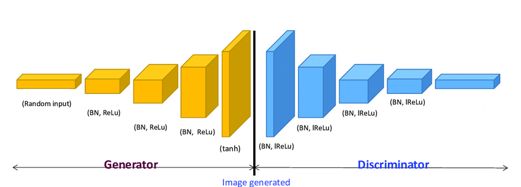
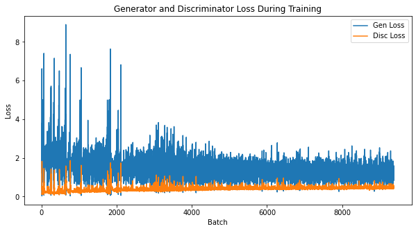
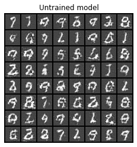
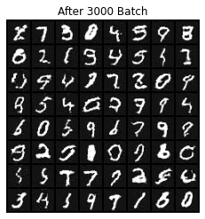
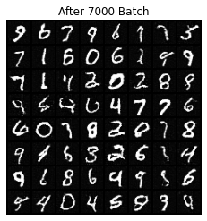
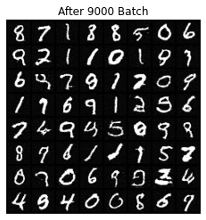
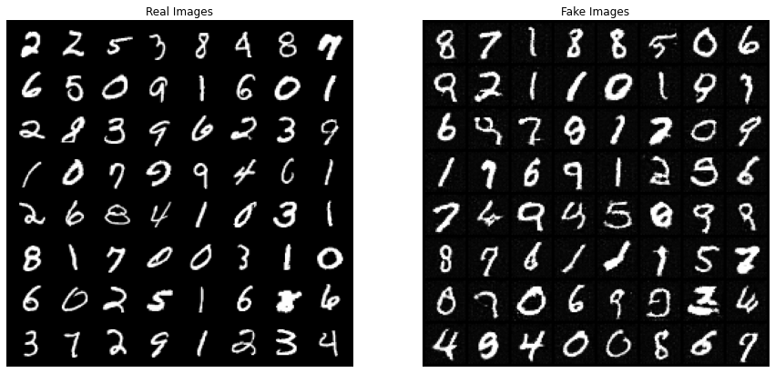
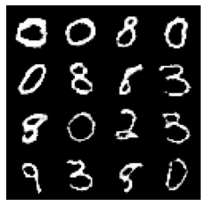

# Build a Deep Convolutional Generative Adversarial Network with PyTorch to generate handwritten digits


## Notes
The `requirements.txt` file should list all Python libraries that our models depends on, and they will be installed using:

```
pip install -r requirements.txt
```

## Behaviour
In this project, we will implement Deep Convolutional Generative Adversarial Network `(DCGAN)` using PyTorch to generate handwritten digits. You will create a generator that will learn to generate images that look real and a discriminator that will learn to tell real images apart from fakes.

<br><br>



## Principe
Generative Adversarial Network (GAN) is a famous neural network model, its function is to input a set of noise and then generate a set of fake pictures through the Generator, and then use the Discriminator to distinguish whether it is a real picture. <br>First train a simple Discriminator classifier, and then train a Generator. The two models fight and train repeatedly, and finally take the trained Generator model. We can randomly generate noise and generate pictures at will!

## Steps
The notebook of project is divided on parts that are :
1. Configurations
2. Load MNIST Handwritten Dataset
3. Load Dataset into Batches
4. Create Discriminator Network 
5. Create Generator Network
6. Create Loss Function and Load Optimizers
7. Training GAN Model
8. Model Evaluation

## Results
1. Generator and Discriminator Loss During Training :



2. Progression of Generation of Handwritten Digits During Training :

 
<br>
>After 8000 batches, the generator started to generate real numbers as seen in the figures above.

3. Real and Fake Handwritten Digits Perception After Training :



4. Random Generation of Handwritten Digits After Training :


## Author
_Zakaria Mejdoul_


<br><br>_Enjoy generating and classifying handwritten digits :exclamation: :v:_
